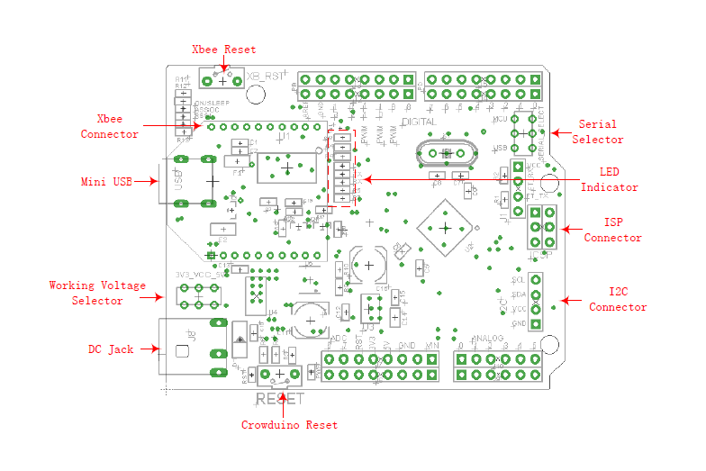

# Crowduino_v1.0

## Description

**We sale Crowduio V1.1 now, it is almost the same as Crowduino V1.0. it added wireless programming function using 2 XBee module.** **please visit [Crowduino V1.1 wiki](http://www.elecrow.com/wiki/index.php?title=Crowduino_v1.1) for more details.**

The Crowduino is Arduino compatible board. Based on arduino Duemilanuve Schematic, 100% compatible to its existing program, shield and IDEs.

it is a microcontroller board based on the ATmega328 (datasheet). It has 14 digital input/output pins (of which 6 can be used as PWM outputs), 6 analog inputs, a 16 MHz ceramic resonator, a USB connection, a power jack, an ICSP header, a reset button, and a XBee socket. It contains everything needed to support the microcontroller; simply connect it to a computer with a USB cable or power it with a AC-to-DC adapter or battery to get started.

Crowduino differs from all preceding boards in that it contains Shield and XBee socket . it adapts to all the shield that compatible with arduino Uno. it also adapts to the Xbee modules from Digi,and any module with the same footprint.

**Model [MCA01328A](http://www.elecrow.com/arduino-compatiable-c-109/micro-controller-c-109_117/crowduino-with-atmega-328-p-338.html)**

## Summary

| Microcontroller             | ATmega328                                            |
| --------------------------- | ---------------------------------------------------- |
| Operating Voltage           | 5v                                                   |
| Input Voltage (recommended) | 7-12V                                                |
| Digital I/O Pins            | 14 (of which 6PINs provide PWM output)               |
| Analog Input Pins           | 8                                                    |
| DC Current per I/O Pin      | 40mA                                                 |
| DC Current for 3.3V Pin     | 50 mA                                                |
| Flash Memory                | 32 KB (ATmega328) of which 0.5 KB used by bootloader |
| SRAM                        | 2 KB (ATmega328)                                     |
| EEPROM                      | 1 KB (ATmega328)                                     |
| Clock Speed                 | 16 MHz                                               |

## Features

- It contains Bee Shield that you can wireless communicate to the microcontroller
- Flat DC Jack.
- Inherits all of Arduino Duemilanuve's features.
- Compatible to Uno's pin layout, screw hole and dimensions.
- Evolved with SMD components.

## Interface Function

## Usage

Except 100% compatible with Arduino,Crowduino has another funtion that it also adapts to the Xbee modules from Digi,and other Bee module with the same footprint.

## FAQ

There are a number of switches that I am unsure of the function of, not having seen them on another Arduino board:

***Q:****3V3_VCC_5V: Does this convert the entire board to output 3V3 or 5V, or is it input voltage?*

**A:**This is the input voltage choice switch.
If you push the switch to 3v3, and set the output pin to high, the votage of it is 3v3.
If you push the switch to 5v, and set the output pin to high, the votage of it is 5v.

***Q****:What does the "serial select" switch do?*

**A:**This switch is to choose Rx, Tx PIN of XBee connect to RX, TX of atmega328 or RX, TX of XBee connect to TX, RX pin of atmega328.
The theory is that if you connect the RX pin of XBee to TX pin of atmega328, The Xbee or XBee compatible Bee can communicate with atmega328 through Serial port. if you connect the RX pin of XBee to the RX pin of atmega328, the RX pin of XBee will connect to the TX of FTDI, the XBee can commucate with you computer through Serial port.

## Resources

- [Crowduino Schematic in PDF](http://www.elecrow.com/wiki/images/4/44/Crowduino_v1.02.pdf)
- [Crowduino eagle files](http://www.elecrow.com/wiki/images/5/57/Crowduino.zip)

## How to buy

Please visit [this page](http://www.elecrow.com/arduino-compatiable-c-109/micro-controller-c-109_117/crowduino-with-atmega-328-p-338.html) to purchase Crowduino.

## Support

If you have any problem about how to use it, you can connect to us at [the bottom-right of bazzer](http://www.elecrow.com/) or contact to **techsupport@elecrow.com** to get technology support.