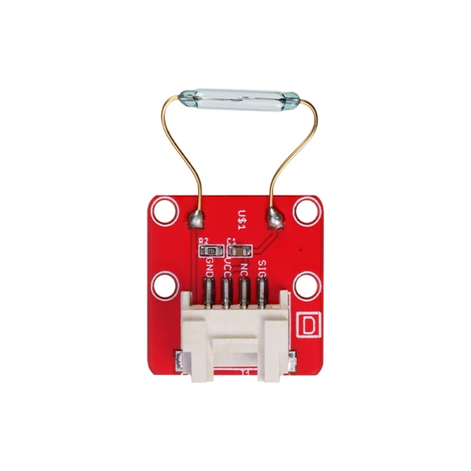

## Description
-----------

This is a Crowtail interface compatible Magnetic switch module. It is based on encapsulated dry reed switch MKA14103. MKA14103 is single-pole, single throw (SPST) type, having normally open ruthenium contacts. The sensor is a double-ended type and may be actuated with an electromagnet, a permanent magnet or a combination of both. The magnetic switch is a wonderful tool for designers who would like to turn a circuit on and off based on proximity.

**Model: [CT009320S](http://www.elecrow.com/crowtail-magnetic-switch-p-1654.html)**  
{ loading=lazy }

## Features
--------

- Crowtail compatible interface
- Minimum external parts
- 10W rating
- Rugged encapsulation

## Application Ideas
-----------------

- Proximity Sensor
- Security Alarm Sensor
- Level Sensor
- Flow Sensor
- Pulse Counter

## Specification
-------------

Dimensions(mm):27.8(L)x20.0(W)x6.8(H)

| Item | Min | Norm | Max | Unit |
|---|---|---|---|---|
| Working Voltage | 4.75 | 5.0 | 5.25 | V |
| Switched Power | 10 | 10 | 10 | W |
| Switched Voltage AC,RMS value(max) | &lt; 140 | &lt; 140 | &lt; 140 | V |
| Switched Current DC | &lt; 500 | &lt; 500 | &lt; 500 | mA |
| Carry Current DC | &lt; 0.5 | &lt; 0.5 | &lt; 0.5 | A |
| Contact Resistance | &lt;200 | &lt;200 | &lt;200 | mΩ |
| Insulation Resistance | &gt;106 | &gt;106 | &gt;106 | MΩ |
| Operating Temperature | -40 | - | 125 | ℃ |
| Operate Range | 10 | - | 40 | AT |

## Usage
-----

### **With Arduino**

1.The SIG pin of the module output LOW normally. When a magnet approaches the switch, the magnetic switch close and the SIG pin output HIGH. The following sketch demonstrates a simple application of using the Magnetic switch to control the led. When you put a magnet that has enough magnetic power close to the module, the switch is closed .Then the SIG pin out put a high voltage. You can use this to control the led. As the picture on the below indicates, the Magnetic switch is connected to digital port 2 of the Crowtail - Basic Shield and the LED is connected to digital port 5. When there is Magnetic approaches the switch, the SIG pin output a High voltage. Then the LED light. The hardware installation is as follows:

{ loading=lazy }

2.Copy and paste code below to a new Arduino sketch.

```
#define MAGNECTIC_SWITCH 2
#define LED	5//the on board LED of the Arduino or Seeeduino

void setup()
{
 	pinsInit();
}
 
void loop() 
{
	if(isNearMagnet())//if the magnetic switch is near the magnet?
	{
		turnOnLED();
	}
	else
	{
		turnOffLED();
	}
}
void pinsInit()
{
	pinMode(MAGNECTIC_SWITCH, INPUT);
	pinMode(LED,OUTPUT);
}

/*If the magnetic switch is near the magnet, it will return ture, */
/*otherwise it will return false								*/
boolean isNearMagnet()
{
	int sensorValue = digitalRead(MAGNECTIC_SWITCH);
	if(sensorValue == HIGH)//if the sensor value is HIGH?
	{
		return true;//yes,return ture
	}
	else
	{
		return false;//no,return false
	}
}
void turnOnLED()
{
	digitalWrite(LED,HIGH);
}
void turnOffLED()
{
	digitalWrite(LED,LOW);
}

```

Then the LED light when there is Magnetic approaches the switch. Have a try!

## Resources
---------

- [Crowtail- Magnetic Switch eagle file ](../../files/Crowtail-Magnetic-Switch-zip.md)