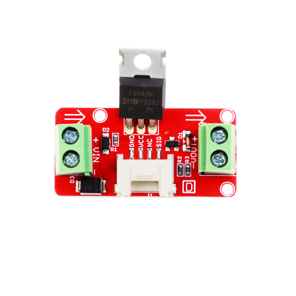

## Description
-----------

Crowtail- MOSFET enables you to control higher voltage project, say 50VDC, with low voltage, say 5V, on microcontroller. MOSFET is also a kind of switch. There are two screw terminals on the board. One for input power source and the other for device you want to control. Crowtail- MOSFET will pass the power from one end to another when closed. But if outer power source is absent, your device can still draw power from microcontroller via the Crowtail interface.

**Model: [CT0016MS](http://www.elecrow.com/crowtail-mosfet-p-1248.html)**



## Feature
-------

- Working voltage: 5V
- Vin: 5 ~ 15V
- MOSFET Model:IRF9540N
- Dimensions(mm):40.0(L)x20.0(W)x20.0(H)

## Usage
-----

Here we demonstrates how to use Crowtail- MOSFET to control a DC motor. We provide power for it with external power source.

1.Connect this module to one of digital port D5 of Crowtail - Base Shield with the Crowtail cable

2.Plug Crowtail - Base Shield into the Arduino/Crowduino and connnect Arduino to PC via a USB cable.

3.The hardware installation as shown below:

{ loading=lazy }

4.Copy and paste code below to a new Arduino sketch.

```
int motorPin = 5;

void setup()
{
   Serial.begin(9600);
   pinMode(motorPin, OUTPUT);
   Serial.println("Crowtail- MOSFET Test Demo!");
}
 
void loop()
{
   motorOnThenOffWithSpeed();
   motorAcceleration();
}

void motorOnThenOffWithSpeed()
{
   int onSpeed  = 200;                         // a number between 0 (stopped) and 255 (full speed)
   int onTime   = 2500;
   int offSpeed = 50;                          // a number between 0 (stopped) and 255 (full speed)
   int offTime  = 1000;
   analogWrite(motorPin, onSpeed);
   delay(onTime);
   analogWrite(motorPin, offSpeed);
   delay(offTime);
}
 
void motorAcceleration()
{
   int delayTime = 50;
   for(int i=0; i<256; i++)
   {
       analogWrite(motorPin, i);
       delay(delayTime);
   }

   for(int i=255; i>=0; i--)
   {
       analogWrite(motorPin, i);
       delay(delayTime);
   }
}
```

5.Upload the code, you can see the motor will accelerate slowly and then decelerate, rotates in circulating.

## Resource
--------

- [MOSFET Program](../../files/MOSFET-zip.md)
- [Crowtail-MOSFET eagle files](../../files/Crowtail-MOSFET-eagle-files-zip.md)
- [IRF9540N.pdf](../../files/IRF9540N-pdf.md)