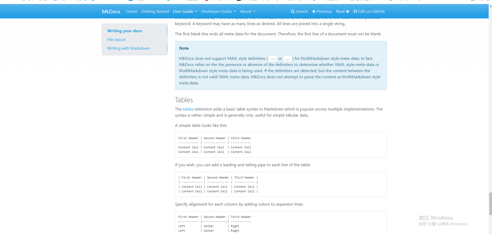
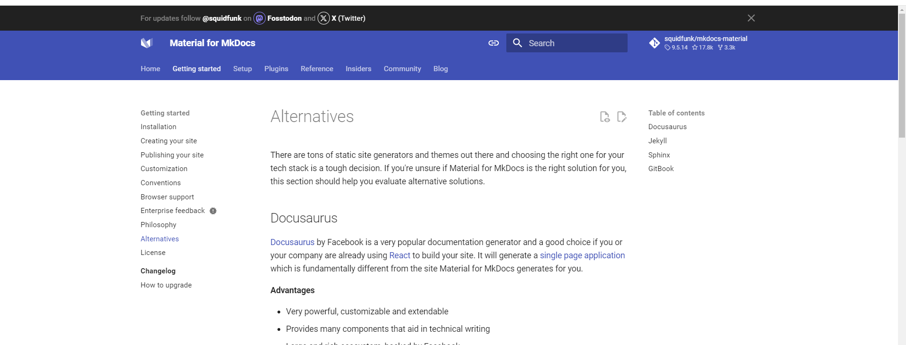

# Welcome to Elecrow Wiki

## Markdown

基本语法： https://markdown.p2hp.com/index.html

编辑软件推荐：

- **Typora**  优秀的 MD网页文章 书写软件
  - https://typora.whsykji.com/index.html?bd_vid=10853641031919563602
- **印象笔记**  功能比较强大，可以随时同步到手机端或电脑端进行查看和编辑
  - https://www.yinxiang.com/product/markdown1-baidu/?utm_source=b1&utm_medium=b1&utm_term=32244&bd_vid=10497411079901125151
- **Obsidian** **银河系最强MD+双向链**  笔记软件 
  - https://obsidian.md/

## 需求

1. 主题选择——优化主页界面

    1) mkdocs自带主题：

     - 
     - 

    2) 第三方插件 

     https://github.com/mkdocs/mkdocs/wiki/MkDocs-Themes

     https://github.com/mkdocs/mkdocs-bootswatch

    3) 设计静态首页

2. nav

3. 产品列表

## What's in it for me?

The moment you [become a sponsor][how to become a sponsor], you'll get __immediate
access to 26 additional features__ that you can __start using now__, and
which are currently exclusively available to sponsors:

- [x] [Blog plugin: pinned posts] :material-alert-decagram:{ .mdx-pulse title="Added on February 24, 2024" }
- [x] [Instant previews] :material-alert-decagram:{ .mdx-pulse title="Added on January 28, 2024" }
- [x] [Footnote tooltips] :material-alert-decagram:{ .mdx-pulse title="Added on January 24, 2024" }
- [x] [Tags plugin: advanced settings]
- [x] [Tags plugin: nested tags]
- [x] [Tags plugin: shadow tags]
- [x] [Stay on page when switching languages]
- [x] [Blog plugin: author profiles]
- [x] [Blog plugin: advanced settings]
- [x] [Projects plugin]
- [x] [Instant prefetching]
- [x] [Social plugin: custom layouts]
- [x] [Social plugin: background images]
- [x] [Code range selection]
- [x] [Code annotations: custom selectors]
- [x] [Privacy plugin: advanced settings]
- [x] [Optimize plugin]
- [x] [Navigation path] (Breadcrumbs)
- [x] [Typeset plugin]
- [x] [Privacy plugin: external links]
- [x] [Navigation subtitles]
- [x] [Tags plugin: allow list] + [custom sorting]
- [x] [Blog plugin: custom index pages]
- [x] [Blog plugin: related links]
- [x] [Meta plugin]
- [x] [Tags plugin: configurable listings]

